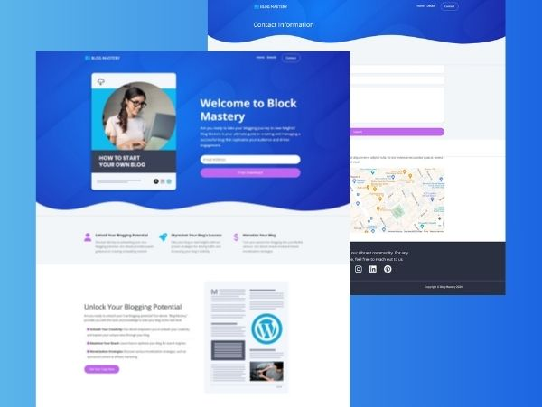

# Blog Mastery / E-Book Website 
## Developed project during the "Bootstrap 5 From Scratch | Build 5 Modern Websites" course of Udemy.

### -> Description
This project it's a simple website for a fictitious company named "Blog Mastery", which sells E-books.

### -> Technologies
      

### -> Figma Design Demo

  <a href="https://yelpcamp-xup4.onrender.com/"><strong>➥ Live Demo</strong></a>

 

### -> Website

  <a href="https://yelpcamp-xup4.onrender.com/"><strong>➥ Live Demo</strong></a>

 

### -> Developer
#### **Name**: _Ramirez Flores Abril._
#### **Checkout my other projects** :octocat: [iscRamirezAbril](https://github.com/iscRamirezAbril)
#### **Profession**: UI/UX Designer